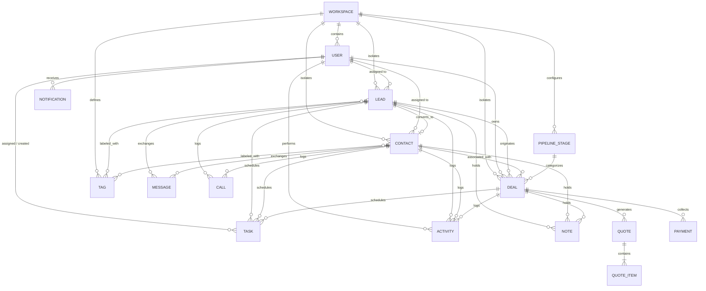

# SalesMax CRM - Database Design Document

## Introduction

This document presents the database design and relational architecture for SalesMax CRM, a multi-tenant customer relationship management platform. The design is architected to support high-velocity sales pipelines, omni-channel customer interactions (WhatsApp, telephony, email, and marketplace lead aggregators), detailed activity tracking, quotes, and payment collections.

### Design Approach

The database follows a relational architecture built upon core design tenets:

1. **Multi-Tenant Isolation**: Every tenant entity is partitioned by a `workspace_id` foreign key. This ensures data isolation across companies, simplifies tenant-level data governance, and enables Row-Level Security (RLS).
2. **Hybrid Relational and Semi-Structured Modeling**: Strongly typed relational tables guarantee referential integrity and consistency for core CRM entities, while `JSONB` fields provide flexibility for custom fields, integration payloads, and tenant configurations without requiring schema migrations.
3. **Unified Activity Stream**: All customer touchpoints (calls, messages, notes, tasks, stage transitions) feed into a chronological activity model, giving sales representatives and managers a complete 360-degree timeline.
4. **Comprehensive Auditability**: Consistent timestamping and user attribution across all tables ensure complete operational traceability.

---

## Entity Overview

| Entity | Description |
|--------|-------------|
| Workspace | A company/organization account providing tenant isolation |
| User | A person who uses the CRM |
| Lead | A potential customer or prospect before qualification |
| Contact | A confirmed contact or customer |
| Activity | A logged event on a lead, contact, or deal |
| Task | A to-do item assigned to a user |
| Deal | A business opportunity or sale |
| PipelineStage | A stage in the sales pipeline |
| Note | A text note on a lead, contact, or deal |
| Message | A WhatsApp or other message |
| Call | A phone call record |
| Quote | A price quote or proposal |
| QuoteItem | A line item in a quote |
| Payment | A payment record |
| Notification | An in-app notification |
| Integration | An external service connection |
| Webhook | A webhook configuration |
| Tag | A label for categorizing leads and contacts |

---

## Entity Details

### Workspace
Multi-tenant isolation root. Each company has its own workspace, isolating all users, leads, deals, and configurations.

| Field Name | Type | Description |
|------------|------|-------------|
| id | UUID | Primary key uniquely identifying the workspace |
| name | VARCHAR | Display name of the company or organization |
| slug | VARCHAR | Unique URL-safe identifier for workspace routing |
| settings | JSONB | Workspace settings (currency default, working hours, preferences) |
| created_at | TIMESTAMPTZ | Record creation timestamp |
| updated_at | TIMESTAMPTZ | Record update timestamp |

- **Relationships**: Has many Users, Leads, Contacts, Deals, PipelineStages, Activities, Tasks, Notes, Messages, Calls, Quotes, Payments, Notifications, Integrations, Webhooks, and Tags.

### User
A person who logs into and uses the CRM within a specific workspace, performing sales activities and managing customer records.

| Field Name | Type | Description |
|------------|------|-------------|
| id | UUID | Primary key uniquely identifying the user |
| workspace_id | UUID | Foreign key referencing Workspace |
| email | VARCHAR | Unique login email address |
| password_hash | VARCHAR | Hashed password credential |
| first_name | VARCHAR | User's given name |
| last_name | VARCHAR | User's family name |
| role | ENUM | Access role: `admin`, `manager`, `sales_executive` |
| phone | VARCHAR | Direct contact phone number |
| avatar_url | VARCHAR | URL pointing to user's profile picture |
| is_active | BOOLEAN | Account activation status flag |
| last_login_at | TIMESTAMPTZ | Timestamp of most recent user login |
| created_at | TIMESTAMPTZ | Record creation timestamp |
| updated_at | TIMESTAMPTZ | Record update timestamp |

- **Relationships**: Belongs to Workspace. Has many assigned Leads (`assigned_to`), Tasks (`assigned_to`), Deals (`assigned_to`), and Activities (`performed_by`).

### Lead
A prospective customer or inquiry captured from marketing channels before qualification and conversion into a contact.

| Field Name | Type | Description |
|------------|------|-------------|
| id | UUID | Primary key uniquely identifying the lead |
| workspace_id | UUID | Foreign key referencing Workspace |
| first_name | VARCHAR | Prospect first name |
| last_name | VARCHAR | Prospect last name |
| email | VARCHAR | Contact email address |
| phone | VARCHAR | Primary contact phone number |
| company_name | VARCHAR | Name of prospect's organization |
| designation | VARCHAR | Job title or role |
| source | ENUM | Ingestion channel: `manual`, `web_form`, `facebook`, `google`, `indiamart`, `justdial`, `referral`, `other` |
| status | ENUM | Qualification status: `new`, `contacted`, `qualified`, `unqualified`, `converted`, `lost` |
| assigned_to | UUID | Foreign key referencing assigned User (nullable) |
| converted_contact_id | UUID | Foreign key referencing resulting Contact once converted (nullable) |
| custom_fields | JSONB | Dynamic tenant-defined lead attributes |
| last_activity_at | TIMESTAMPTZ | Timestamp of the latest recorded interaction |
| created_at | TIMESTAMPTZ | Record creation timestamp |
| updated_at | TIMESTAMPTZ | Record update timestamp |

- **Relationships**: Belongs to Workspace. Belongs to User (`assigned_to`). Optionally links to converted Contact (`converted_contact_id`). Has many Activities, Tasks, Notes, Deals, Messages, and Calls. Many-to-many with Tag (via `lead_tags`).

### Contact
A verified customer or business contact associated with ongoing accounts, communications, and deals.

| Field Name | Type | Description |
|------------|------|-------------|
| id | UUID | Primary key uniquely identifying the contact |
| workspace_id | UUID | Foreign key referencing Workspace |
| first_name | VARCHAR | Contact given name |
| last_name | VARCHAR | Contact surname |
| email | VARCHAR | Primary email address |
| phone | VARCHAR | Primary phone number |
| company_name | VARCHAR | Associated company name |
| designation | VARCHAR | Professional role or title |
| address | TEXT | Street address |
| city | VARCHAR | City |
| state | VARCHAR | State or province |
| pincode | VARCHAR | Postal code / PIN code |
| source_lead_id | UUID | Foreign key referencing original Lead if converted (nullable) |
| assigned_to | UUID | Foreign key referencing account manager User (nullable) |
| created_at | TIMESTAMPTZ | Record creation timestamp |
| updated_at | TIMESTAMPTZ | Record update timestamp |

- **Relationships**: Belongs to Workspace. Belongs to User (`assigned_to`). Optionally references originating Lead (`source_lead_id`). Has many Deals, Activities, Tasks, Notes, Messages, and Calls. Many-to-many with Tag (via `contact_tags`).

### Activity
The central timeline log. Every interaction or status change generates an activity record for audit and timeline review.

| Field Name | Type | Description |
|------------|------|-------------|
| id | UUID | Primary key uniquely identifying the activity record |
| workspace_id | UUID | Foreign key referencing Workspace |
| type | ENUM | Category: `note`, `call`, `email`, `whatsapp`, `status_change`, `task_created`, `deal_created`, `meeting`, `other` |
| description | TEXT | Descriptive summary of the event |
| lead_id | UUID | Foreign key referencing Lead (nullable) |
| contact_id | UUID | Foreign key referencing Contact (nullable) |
| deal_id | UUID | Foreign key referencing Deal (nullable) |
| performed_by | UUID | Foreign key referencing User who performed the action |
| metadata | JSONB | Contextual data payload (e.g., stage change diff, call duration, template ID) |
| created_at | TIMESTAMPTZ | Record creation timestamp |

- **Relationships**: Belongs to Workspace. Belongs to User (`performed_by`). Belongs optionally to Lead, Contact, or Deal.

### Task
An actionable to-do item or scheduled follow-up assigned to a user, ensuring systematic lead nurturing and deal momentum.

| Field Name | Type | Description |
|------------|------|-------------|
| id | UUID | Primary key uniquely identifying the task |
| workspace_id | UUID | Foreign key referencing Workspace |
| title | VARCHAR | Concise title of the action item |
| description | TEXT | Detailed notes or briefing for the task |
| type | ENUM | Action type: `call`, `email`, `whatsapp`, `meeting`, `follow_up`, `other` |
| priority | ENUM | Urgency level: `low`, `medium`, `high` |
| status | ENUM | Progress state: `pending`, `in_progress`, `completed`, `cancelled` |
| due_date | DATE | Scheduled date for task completion |
| due_time | TIME | Scheduled time for task completion (nullable) |
| assigned_to | UUID | Foreign key referencing assigned User |
| created_by | UUID | Foreign key referencing creator User |
| lead_id | UUID | Foreign key referencing Lead (nullable) |
| contact_id | UUID | Foreign key referencing Contact (nullable) |
| deal_id | UUID | Foreign key referencing Deal (nullable) |
| completed_at | TIMESTAMPTZ | Timestamp when completed (nullable) |
| created_at | TIMESTAMPTZ | Record creation timestamp |
| updated_at | TIMESTAMPTZ | Record update timestamp |

- **Relationships**: Belongs to Workspace. Belongs to User (`assigned_to` and `created_by`). Optionally linked to Lead, Contact, or Deal.

### Deal
A commercial business opportunity or pending sale progressing through the sales pipeline.

| Field Name | Type | Description |
|------------|------|-------------|
| id | UUID | Primary key uniquely identifying the deal |
| workspace_id | UUID | Foreign key referencing Workspace |
| title | VARCHAR | Name or title of the opportunity |
| value | DECIMAL(14,2) | Monetary value of the deal |
| currency | VARCHAR(3) | ISO currency code (default `'INR'`) |
| stage_id | UUID | Foreign key referencing active PipelineStage |
| probability | INT | Win probability percentage (0 to 100) |
| expected_close_date | DATE | Estimated closing date |
| actual_close_date | DATE | Actual date closed won or lost (nullable) |
| assigned_to | UUID | Foreign key referencing deal owner User |
| lead_id | UUID | Foreign key referencing source Lead (nullable) |
| contact_id | UUID | Foreign key referencing associated Contact (nullable) |
| lost_reason | TEXT | Rationale for lost opportunity (nullable) |
| won_reason | TEXT | Key success factors for won deal (nullable) |
| created_at | TIMESTAMPTZ | Record creation timestamp |
| updated_at | TIMESTAMPTZ | Record update timestamp |

- **Relationships**: Belongs to Workspace. Belongs to PipelineStage (`stage_id`). Belongs to User (`assigned_to`). Linked to Lead or Contact. Has many Activities, Tasks, Notes, Quotes, and Payments.

### PipelineStage
A configurable phase within the visual sales Kanban pipeline. Workspace admins can customize the pipeline to reflect their sales workflow.

| Field Name | Type | Description |
|------------|------|-------------|
| id | UUID | Primary key uniquely identifying the stage |
| workspace_id | UUID | Foreign key referencing Workspace |
| name | VARCHAR | Name of stage (e.g., New, Qualified, Proposal Sent, Negotiation, Won, Lost) |
| display_order | INT | Numeric order for sorting columns on the board |
| color | VARCHAR | UI color code for visual indicators |
| is_won | BOOL | Indicates if stage marks a deal as closed-won |
| is_lost | BOOL | Indicates if stage marks a deal as closed-lost |
| created_at | TIMESTAMPTZ | Record creation timestamp |

- **Default Stages**: `New`, `Qualified`, `Proposal Sent`, `Negotiation`, `Won` (`is_won = true`), `Lost` (`is_lost = true`).
- **Relationships**: Belongs to Workspace. Has many Deals.

### Note
A plain or formatted text note attached to a customer record, preserving unstructured qualitative context.

| Field Name | Type | Description |
|------------|------|-------------|
| id | UUID | Primary key uniquely identifying the note |
| workspace_id | UUID | Foreign key referencing Workspace |
| content | TEXT | Body content of the note |
| lead_id | UUID | Foreign key referencing Lead (nullable) |
| contact_id | UUID | Foreign key referencing Contact (nullable) |
| deal_id | UUID | Foreign key referencing Deal (nullable) |
| created_by | UUID | Foreign key referencing author User |
| created_at | TIMESTAMPTZ | Record creation timestamp |
| updated_at | TIMESTAMPTZ | Record update timestamp |

- **Relationships**: Belongs to Workspace. Belongs to User (`created_by`). Linked to Lead, Contact, or Deal.

### Message
An inbound or outbound communication record across digital channels such as WhatsApp, SMS, or email.

| Field Name | Type | Description |
|------------|------|-------------|
| id | UUID | Primary key uniquely identifying the message |
| workspace_id | UUID | Foreign key referencing Workspace |
| channel | ENUM | Channel: `whatsapp`, `sms`, `email` |
| direction | ENUM | Communication direction: `inbound`, `outbound` |
| content | TEXT | Message body text or template content |
| lead_id | UUID | Foreign key referencing Lead (nullable) |
| contact_id | UUID | Foreign key referencing Contact (nullable) |
| sent_by | UUID | Foreign key referencing sender User (nullable for inbound) |
| status | ENUM | Delivery state: `sent`, `delivered`, `read`, `failed` |
| external_id | VARCHAR | Provider message ID (e.g., WhatsApp message ID) |
| created_at | TIMESTAMPTZ | Record creation timestamp |

- **Relationships**: Belongs to Workspace. Linked to Lead or Contact. Optionally belongs to User (`sent_by`).

### Call
A phone call record capturing telephony details, outcomes, and audio recordings for quality assurance.

| Field Name | Type | Description |
|------------|------|-------------|
| id | UUID | Primary key uniquely identifying the call record |
| workspace_id | UUID | Foreign key referencing Workspace |
| lead_id | UUID | Foreign key referencing Lead (nullable) |
| contact_id | UUID | Foreign key referencing Contact (nullable) |
| caller | UUID | Foreign key referencing User who handled the call |
| direction | ENUM | Route direction: `inbound`, `outbound` |
| duration_seconds | INT | Call duration in seconds |
| outcome | ENUM | Result: `connected`, `not_answered`, `busy`, `wrong_number`, `callback_requested`, `voicemail` |
| recording_url | VARCHAR | Storage URL of the audio recording (nullable) |
| notes | TEXT | Call summary notes by the executive (nullable) |
| started_at | TIMESTAMPTZ | Call start timestamp |
| ended_at | TIMESTAMPTZ | Call end timestamp (nullable) |
| created_at | TIMESTAMPTZ | Record creation timestamp |

- **Relationships**: Belongs to Workspace. Linked to Lead or Contact. Belongs to User (`caller`).

### Quote
A formal commercial price quote or proposal generated for a deal prospect.

| Field Name | Type | Description |
|------------|------|-------------|
| id | UUID | Primary key uniquely identifying the quote |
| workspace_id | UUID | Foreign key referencing Workspace |
| deal_id | UUID | Foreign key referencing Deal |
| quote_number | VARCHAR | Human-readable quote reference number |
| status | ENUM | State: `draft`, `sent`, `accepted`, `rejected`, `expired` |
| subtotal | DECIMAL(14,2) | Net item totals before taxes and discounts |
| tax_amount | DECIMAL(14,2) | Total tax amount |
| discount_amount | DECIMAL(14,2) | Discount deduction amount |
| total | DECIMAL(14,2) | Final payable total |
| valid_until | DATE | Expiration date of the offer |
| created_by | UUID | Foreign key referencing author User |
| created_at | TIMESTAMPTZ | Record creation timestamp |
| updated_at | TIMESTAMPTZ | Record update timestamp |

- **Relationships**: Belongs to Workspace. Belongs to Deal. Belongs to User (`created_by`). Has many QuoteItems.

### QuoteItem
A single product or service line item within a price quote.

| Field Name | Type | Description |
|------------|------|-------------|
| id | UUID | Primary key uniquely identifying the line item |
| quote_id | UUID | Foreign key referencing Quote |
| description | TEXT | Item or service description |
| quantity | DECIMAL(10,2) | Number of units or service count |
| unit_price | DECIMAL(14,2) | Price per single unit |
| tax_percent | DECIMAL(5,2) | Tax rate percentage |
| discount_percent | DECIMAL(5,2) | Item discount percentage |
| line_total | DECIMAL(14,2) | Final computed line total |
| display_order | INT | Display order index on the proposal |

- **Relationships**: Belongs to Quote.

### Payment
A financial collection record tracking funds received against an active or won deal.

| Field Name | Type | Description |
|------------|------|-------------|
| id | UUID | Primary key uniquely identifying the payment |
| workspace_id | UUID | Foreign key referencing Workspace |
| deal_id | UUID | Foreign key referencing Deal |
| amount | DECIMAL(14,2) | Amount received |
| payment_date | DATE | Date payment was realized |
| method | ENUM | Mode: `cash`, `upi`, `bank_transfer`, `cheque`, `card`, `other` |
| reference_number | VARCHAR | Transaction reference, UTR, or cheque number (nullable) |
| notes | TEXT | Supplementary transaction remarks (nullable) |
| recorded_by | UUID | Foreign key referencing User who recorded the transaction |
| created_at | TIMESTAMPTZ | Record creation timestamp |

- **Relationships**: Belongs to Workspace. Belongs to Deal. Belongs to User (`recorded_by`).

### Notification
An in-app message or reminder alerting a user about deal milestones, assignments, or deadlines.

| Field Name | Type | Description |
|------------|------|-------------|
| id | UUID | Primary key uniquely identifying the notification |
| workspace_id | UUID | Foreign key referencing Workspace |
| user_id | UUID | Foreign key referencing recipient User |
| type | ENUM | Category: `lead_assigned`, `task_due`, `follow_up_reminder`, `deal_stage_changed`, `mention`, `system` |
| title | VARCHAR | Short notification subject |
| message | TEXT | Detailed notification message |
| is_read | BOOL | Flag indicating if user has read the notice |
| link | VARCHAR | Optional in-app target URL path |
| created_at | TIMESTAMPTZ | Record creation timestamp |
| read_at | TIMESTAMPTZ | Timestamp when marked as read (nullable) |

- **Relationships**: Belongs to Workspace. Belongs to User (`user_id`).

### Integration
Stores configurations and API credentials for third-party platforms (e.g., Meta Ads, Google Ads, WhatsApp Cloud, IndiaMART, Justdial).

| Field Name | Type | Description |
|------------|------|-------------|
| id | UUID | Primary key uniquely identifying the integration |
| workspace_id | UUID | Foreign key referencing Workspace |
| provider | ENUM | Vendor: `facebook`, `google`, `whatsapp`, `indiamart`, `justdial` |
| status | ENUM | Connection health: `active`, `inactive`, `error` |
| config | JSONB | Encrypted connection tokens, account IDs, and secrets |
| created_by | UUID | Foreign key referencing User who connected the service |
| created_at | TIMESTAMPTZ | Record creation timestamp |
| updated_at | TIMESTAMPTZ | Record update timestamp |

- **Relationships**: Belongs to Workspace. Belongs to User (`created_by`).

### Webhook
Outbound webhook configurations allowing real-time event dispatching to external endpoints.

| Field Name | Type | Description |
|------------|------|-------------|
| id | UUID | Primary key uniquely identifying the webhook configuration |
| workspace_id | UUID | Foreign key referencing Workspace |
| url | VARCHAR | Destination webhook HTTP/HTTPS URL |
| events | TEXT[] | Subscribed CRM event keys (e.g., `lead.created`, `deal.won`) |
| secret | VARCHAR | Shared signing secret for payload HMAC verification |
| is_active | BOOL | Operational toggle to enable/disable triggers |
| created_by | UUID | Foreign key referencing User who configured the webhook |
| last_triggered_at | TIMESTAMPTZ | Timestamp of the most recent dispatch attempt |
| created_at | TIMESTAMPTZ | Record creation timestamp |

- **Relationships**: Belongs to Workspace. Belongs to User (`created_by`).

### Tag
A reusable label applied to leads and contacts for classification, marketing segmentation, and fast filtering.

| Field Name | Type | Description |
|------------|------|-------------|
| id | UUID | Primary key uniquely identifying the tag |
| workspace_id | UUID | Foreign key referencing Workspace |
| name | VARCHAR | Label text (e.g., "High Value", "Manufacturer", "Urgent") |
| color | VARCHAR | Hex color code for UI badge display |
| created_at | TIMESTAMPTZ | Record creation timestamp |

- **Relationships**: Belongs to Workspace. Many-to-many with Lead via `lead_tags` (`lead_id`, `tag_id`). Many-to-many with Contact via `contact_tags` (`contact_id`, `tag_id`).

---

## Entity Relationship Summary

### Key Cardinalities

- **Workspace 1:N**: User, Lead, Contact, Deal, PipelineStage, Activity, Task, Note, Message, Call, Quote, Payment, Notification, Integration, Webhook, Tag
- **User 1:N**: Lead (`assigned_to`), Task (`assigned_to`, `created_by`), Deal (`assigned_to`), Activity (`performed_by`), Note (`created_by`), Call (`caller`), Quote (`created_by`), Payment (`recorded_by`), Notification (`user_id`)
- **Lead 1:N**: Activity, Task, Note, Message, Call, Deal
- **Contact 1:N**: Activity, Task, Note, Message, Call, Deal
- **Deal N:1**: PipelineStage
- **Deal 1:N**: Quote, Payment, Task, Note, Activity
- **Quote 1:N**: QuoteItem
- **Lead N:M Tag**: Managed via join table `lead_tags` (`lead_id`, `tag_id`)
- **Contact N:M Tag**: Managed via join table `contact_tags` (`contact_id`, `tag_id`)
- **Lead 1:1 Contact**: Optional reference via `converted_contact_id` on Lead and `source_lead_id` on Contact

### Entity Relationship Diagram

---

## Design Decisions

### UUID Primary Keys
Every table uses globally unique identifiers (UUIDv4 or UUIDv7) as primary keys instead of auto-incrementing sequential integers.
- **Security**: Prevents predictable URL enumeration attacks (e.g., guessing `/deals/1001`, `/deals/1002`).
- **Distributed Ingestion**: Client applications, mobile offline apps, and background ingest workers can generate keys without round-trip database coordination.
- **Seamless Merging**: Supports multi-region replication and workspace data export/import without key collisions.

### Workspace ID on Every Table
Except for sub-line entities that strictly belong to a parent entity (such as `QuoteItem` belonging to `Quote`), all entities include a direct `workspace_id` column.
- **Tenant Isolation**: Enables straightforward data partition queries (`WHERE workspace_id = :workspace_id`) across all features.
- **Row-Level Security (RLS)**: Facilitates native PostgreSQL RLS policies that enforce tenant isolation directly at the database engine level.
- **Index Efficiency**: High-performance composite indexes prefixed with `workspace_id` (e.g., `(workspace_id, status)` or `(workspace_id, created_at)`) allow rapid queries scoped to the tenant.

### JSONB Fields for Settings and Custom Fields
Semi-structured `JSONB` columns are incorporated for `Workspace.settings`, `Lead.custom_fields`, `Activity.metadata`, and `Integration.config`.
- **Dynamic Field Extension**: Different industries require unique lead fields (e.g., real estate property size, manufacturing GST numbers, healthcare requirements). JSONB allows dynamic custom fields without physical DDL schema migrations.
- **Polymorphic Event Payloads**: The activity timeline accommodates different metadata shapes (email status, call duration, stage movement diffs) within a single unified table.
- **Indexed Search**: PostgreSQL supports GIN (Generalized Inverted Indexes) on JSONB columns, allowing efficient querying and indexing of internal JSON keys.

### Soft Delete Considerations
To protect business data from accidental loss while maintaining historical reporting accuracy, soft deletes are recommended for core business entities (`Lead`, `Contact`, `Deal`, `Quote`).
- **Implementation**: Introducing an `is_deleted` BOOLEAN flag and a `deleted_at` TIMESTAMPTZ column allows records to be hidden from standard views while remaining available for administrative recovery.
- **Reporting Integrity**: Closed won/lost statistics, financial metrics, and timeline histories remain intact even if an associated record is archived.
- **Partial Indexing**: Performance is preserved by using partial indexes on active records (e.g., `CREATE INDEX ON leads (workspace_id, phone) WHERE NOT is_deleted`).
- **Hard Delete Exemption**: Ephemeral records such as transient notifications or dead webhook delivery attempts can be permanently purged after a defined retention window.

### Standardized Timestamps on Every Table
Every operational table includes `created_at` and `updated_at` timestamps using timezone-aware `TIMESTAMPTZ`.
- **Audit Trail**: Every record change and status transition is recorded in chronological order.
- **Incremental Sync**: Mobile devices and background integration workers can fetch changes using timestamp watermarks (`WHERE updated_at > :last_sync_time`).
- **Timezone Normalization**: UTC-normalized storage avoids ambiguities across users working in different regional time zones.

### Enum Implementation Strategy
Controlled values (such as lead status, source, task priority, and activity type) are managed via an enum approach.
- **PostgreSQL Native ENUM**: Recommended for stable, platform-level state sets (e.g., `Task.priority`, `Message.direction`, `Deal.currency`), offering high storage efficiency (4 bytes) and database-level validation.
- **Validated String / Lookup Table**: For taxonomies that may evolve per workspace (e.g., lead sources, payment methods), constrained `VARCHAR` fields validated at the application layer or backed by workspace configuration tables allow extensibility without requiring database-level schema alters.
